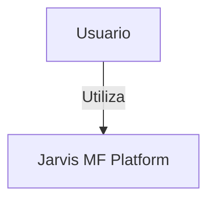
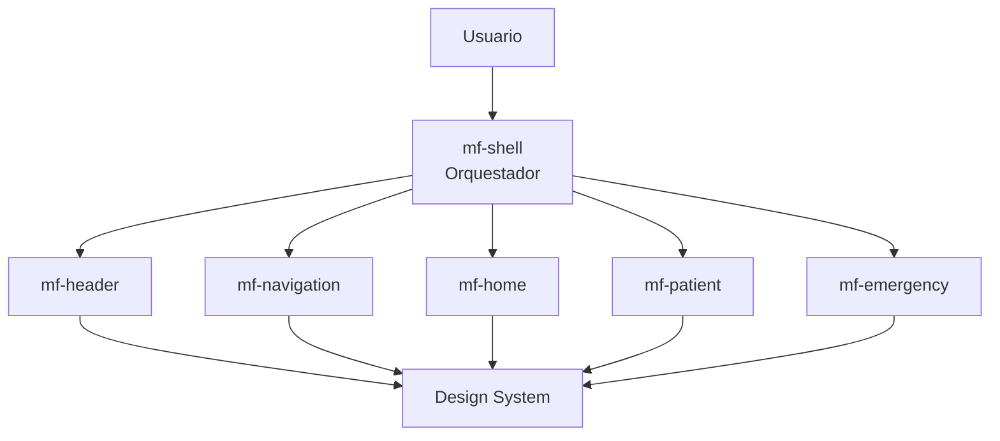
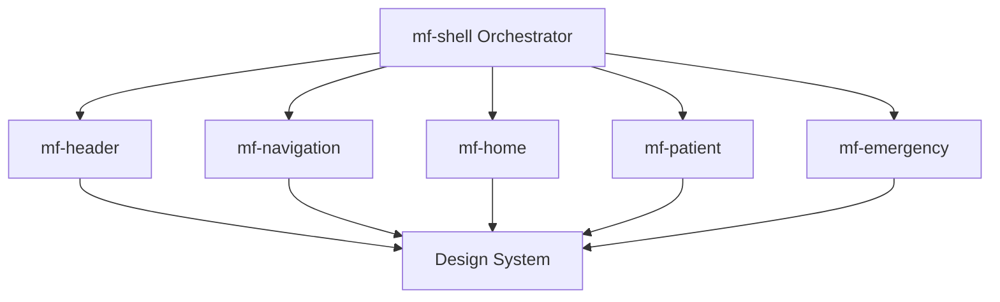

# jarvis-mf-platform


---

## Descripcion

**Jarvis MF Platform** es una arquitectura de referencia para aplicaciones frontend empresariales basada en **Microfrontends**, utilizando **React, Vite y Module Federation**.

El objetivo es demostrar como construir una plataforma frontend **escalable, desacoplada y mantenible**, donde multiples equipos pueden desarrollar microaplicaciones independientes integradas dinamicamente a traves de un **Shell central** y un **Design System compartido**.

---

## Objetivos del Proyecto

- Demostrar una arquitectura **Microfrontend moderna**
- Implementar **orquestacion dinamica de aplicaciones frontend**
- Compartir un **Design System centralizado**
- Permitir **despliegue independiente de microfrontends**
- Mantener **consistencia visual y tecnologica**
- Servir como **referencia arquitectonica empresarial**

---

## Estilo Arquitectonico

| Estilo | Descripcion |
|--------|-------------|
| Microfrontend Architecture | Divide el frontend en aplicaciones independientes por dominio funcional |
| Runtime Composition | El Shell carga microfrontends dinamicamente mediante Module Federation |
| Domain Driven Frontend | Cada microfrontend representa un dominio funcional |
| Design System Driven UI | Los componentes UI provienen de un sistema de diseno compartido |
| Monorepo Architecture | Todos los proyectos se gestionan dentro de un repositorio unico |

---

## Arquitectura C4

### Nivel 1 - Contexto del Sistema



---

### Nivel 2 - Contenedores



---

## Arquitectura de Microfrontends



---

## Estructura del Repositorio

```
jarvis-mf-platform
├── apps
│   ├── mf-shell
│   ├── mf-header
│   ├── mf-navigation
│   ├── mf-home
│   ├── mf-patient
│   └── mf-emergency
├── packages
│   └── design-system
├── package.json
├── tsconfig.json
└── README.md
```

---

## Microfrontends

### mf-shell - Puerto 5000

Aplicacion contenedora responsable de:

- Orquestacion de microfrontends
- Routing global
- Layout principal
- Autenticacion

### mf-header - Puerto 5101

Responsable del encabezado global.

Incluye:

- Identidad visual
- Informacion del usuario
- Branding de la plataforma

### mf-navigation - Puerto 5102

Responsable del menu lateral.

Incluye:

- Menu principal
- Submenus
- Navegacion entre dominios

### mf-home - Puerto 5103

Pantalla principal de la plataforma.

Incluye:

- Dashboard
- Widgets
- Acceso rapido

### mf-patient - Puerto 5104

Dominio funcional de pacientes.

Incluye:

- Gestion de pacientes
- Formularios
- Informacion clinica

### mf-emergency - Puerto 5106

Monitor de Emergencia hospitalario. Ruta de pantalla completa (oculta header y nav del shell).

Incluye:

- Tabla de pacientes en tiempo real
- Prioridades clinicas (1-4)
- Estados de boxes
- Paginacion
- Panel de camas disponibles

---

## Design System

Ubicacion:

```
packages/design-system
```

Responsabilidades:

- Consistencia visual
- Componentes reutilizables
- Centralizacion de estilos
- Control de theming

---

## Estructura del Design System

```
design-system
├── tokens
│   └── emergency.tokens.ts
├── theme
│   ├── theme.ts
│   └── emergencyTheme.ts
├── atoms
│   ├── Button
│   ├── PriorityBadge
│   ├── BoxBadge
│   ├── ClinicalStatusIcon
│   ├── AttentionCode
│   ├── InfoButton
│   └── ActionIconButton
├── molecules
│   ├── EmergencyHeader
│   ├── ActionBar
│   ├── PatientRow
│   ├── PatientTable
│   ├── EmergencyPagination
│   └── BedsAvailabilityTab
└── provider
    └── ThemeProvider.tsx
```

---

## Atomic Design

| Nivel | Descripcion |
|-------|-------------|
| Atoms | Componentes basicos como Button, Badge, Icon |
| Molecules | Composicion de varios atoms |
| Organisms | Componentes complejos como menus o tablas |
| Layout | Estructura de paginas |
| Pages | Composicion final de UI |

---

## Tecnologias

| Tecnologia | Uso |
|------------|-----|
| React | Framework UI |
| Vite | Build tool |
| TypeScript | Tipado estatico |
| Module Federation | Integracion de microfrontends en runtime |
| Material UI | Componentes visuales |
| Emotion | CSS in JS |
| npm workspaces | Monorepo |
| concurrently | Ejecucion paralela de procesos |

---

## Instalacion

> **Requisito:** Verdaccio debe estar activo en `http://localhost:10100` con `@hce/design-system` publicado antes de ejecutar `npm install`.

Clonar el repositorio:

```bash
git clone https://github.com/usuario/jarvis-mf-platform.git
```

Entrar al proyecto:

```bash
cd jarvis-mf-platform
```

Instalar dependencias (instala todas las apps y packages del monorepo):

```bash
npm install
```

---

## Levantar la plataforma

### Desarrollo local

```bash
npm start
```

Esto ejecuta en orden:
1. `build:remotes` - compila los 5 microfrontends remotos
2. `preview:remotes` - sirve los remotes compilados en puertos 10301-10306
3. `dev:shell` - levanta el shell en modo dev en el puerto 10300

Luego abrir:

| URL | Descripcion |
|-----|-------------|
| http://localhost:10300 | Shell principal |
| http://localhost:10300/emergency | Monitor de Emergencia (pantalla completa) |

> **Nota importante:** Module Federation con `@originjs/vite-plugin-federation` v1.x requiere que los remotes esten **compilados y servidos via `preview`**. El servidor `dev` de los remotes no genera `remoteEntry.js`. Por eso el flujo correcto es siempre `build` + `preview` para los remotes.

### Produccion (Docker)

> **Requisito:** Verdaccio debe estar activo en `http://localhost:10100` con `@hce/design-system` publicado antes de hacer el build.

> **Verdaccio solo se necesita en build time.** Una vez que las imágenes están construidas, Verdaccio puede detenerse sin afectar los contenedores en ejecución. El paquete `@hce/design-system` queda compilado dentro del bundle JS de cada imagen — no hay ninguna conexión a Verdaccio en runtime.

Cada microfrontend tiene su propio `Dockerfile` y genera su propia imagen nginx independiente. Esto permite desplegarlo de forma aislada y reutilizarlo desde otros proyectos apuntando a su URL.

No se necesita red Docker interna entre los microfrontends. La integración ocurre en el browser: el shell le pide al browser que cargue cada `remoteEntry.js` desde su puerto correspondiente.

| Servicio | Puerto | URL del remote (para consumir desde otro proyecto) |
|----------|--------|-----------------------------------------------------|
| mf-shell | 10300 | — (orquestador, no es un remote) |
| mf-auth | 10301 | `http://<host>:10301/assets/remoteEntry.js` |
| mf-home | 10302 | `http://<host>:10302/assets/remoteEntry.js` |
| mf-emergency | 10303 | `http://<host>:10303/assets/remoteEntry.js` |
| mf-hospital | 10304 | `http://<host>:10304/assets/remoteEntry.js` |
| mf-ambulatorio | 10305 | `http://<host>:10305/assets/remoteEntry.js` |
| mf-auditoria | 10306 | `http://<host>:10306/assets/remoteEntry.js` |

#### Levantar todos juntos

```bash
docker compose down
docker compose build
docker compose up -d
```

#### Actualizar un solo microfrontend

No es necesario bajar ni reconstruir los demás:

```bash
# Reemplazar mf-emergency con el que cambió
docker compose build mf-emergency
docker compose up -d mf-emergency
```

También se pueden actualizar varios a la vez separando por espacio:

```bash
docker compose build mf-emergency mf-home
docker compose up -d mf-emergency mf-home
```

#### Detener un solo microfrontend

`docker compose down` no acepta servicio individual — usar `stop` + `rm`:

```bash
# Detener y eliminar el contenedor (la imagen queda intacta)
docker compose rm -f -s mf-emergency
#  -s  detiene el contenedor antes de removerlo
#  -f  sin pedir confirmación
```

Para volver a levantarlo sin reconstruir (usa la imagen existente):

```bash
docker compose up -d mf-emergency
```

Para reconstruir y levantar en un solo flujo:

```bash
docker compose rm -f -s mf-emergency
docker compose build mf-emergency
docker compose up -d mf-emergency
```

#### Ver estado de los servicios

```bash
docker compose ps                    # estado de todos
docker compose logs -f mf-emergency  # logs en tiempo real de uno
docker compose logs -f mf-emergency mf-home  # logs de varios
```

#### Consumir un remote desde otro proyecto

Si `mf-emergency` está desplegado en `192.168.42.44:10303`, cualquier shell externo puede usarlo agregando en su `vite.config.ts`:

```ts
federation({
  remotes: {
    emergency: "http://192.168.42.44:10303/assets/remoteEntry.js",
  }
})
```

El browser del usuario descarga el componente en runtime directamente desde ese servidor. El shell externo no necesita conocer el código fuente ni estar en la misma red Docker.

> **⚠️ `npm link` y Docker no son compatibles.** Si tenés `npm link @hce/design-system` activo, el build de Docker fallará porque el symlink apunta a una carpeta fuera del contexto de build. Antes de hacer `docker compose build`, ejecutar en el proyecto afectado:
> ```bash
> npm unlink @hce/design-system
> npm install
> ```

---

### Opcion 2 - Shell en dev con remotes en preview (mismo resultado)

```bash
# Terminal 1 - compilar y servir todos los remotes
npm run build:remotes
npm run preview:remotes

# Terminal 2 - shell
npm run dev:shell
```

---

### Opcion 3 - Levantar cada microfrontend individualmente

Util para desarrollar o debuggear un microfrontend especifico de forma aislada.

**Importante:** Los remotes necesitan `build` + `preview`, no solo `dev`, para que Module Federation funcione correctamente.

#### mf-shell (Shell / Orquestador)

```bash
cd apps/mf-shell
npm run dev
# http://localhost:10300
```

#### mf-home

```bash
cd apps/mf-home
npm run build
npm run preview
# http://localhost:10302
```

#### mf-emergency

```bash
cd apps/mf-emergency
npm run build
npm run preview
# http://localhost:10303
```

Para desarrollo standalone de mf-emergency (sin shell):

```bash
cd apps/mf-emergency
npm run dev
# http://localhost:10303
```

---

## Mapa de puertos

| Microfrontend | Dev | Preview |
|---------------|-----|---------|
| mf-shell | 10300 | 10300 |
| mf-auth | 10301 | 10301 |
| mf-home | 10302 | 10302 |
| mf-emergency | 10303 | 10303 |
| mf-hospital | 10304 | 10304 |
| mf-ambulatorio | 10305 | 10305 |
| mf-auditoria | 10306 | 10306 |

---

## Scripts disponibles en la raiz

| Script | Descripcion |
|--------|-------------|
| `npm start` | Build remotes + preview remotes + dev shell (todo en uno) |
| `npm run build:remotes` | Compila todos los microfrontends remotos |
| `npm run preview:remotes` | Sirve todos los remotes compilados en paralelo |
| `npm run dev:shell` | Levanta solo el shell en modo dev |

### Actualizar un solo microfrontend

Cuando se realizan cambios en un único remote, no es necesario reconstruir todos. El shell resuelve los remotes en runtime buscando `remoteEntry.js`, por lo que basta con reconstruir y re-servir solo el módulo modificado:

```bash
# Reemplazar mf-emergency con el nombre del módulo que cambió
npm run build -w apps/mf-emergency && npm run preview -w apps/mf-emergency
```

El shell tomará los cambios automáticamente en el siguiente reload del navegador, sin necesidad de reiniciarlo.

---

## Principios Arquitectonicos Aplicados

| Principio | Aplicacion |
|-----------|------------|
| Desacoplamiento | Cada microfrontend funciona como aplicacion independiente |
| Reutilizacion | El Design System centraliza componentes UI |
| Escalabilidad | Nuevos microfrontends pueden anadirse sin afectar el sistema |
| Separacion de responsabilidades | Cada dominio tiene su propio microfrontend |
| Consistencia UI | El Design System define estilos globales |
| Composicion dinamica | Module Federation integra aplicaciones en runtime |

---

## Mejoras Futuras

- Dynamic Module Federation
- Registry de microfrontends
- Shared State Management
- Observabilidad frontend
- CI/CD por microfrontend
- Auth centralizado

---

## Autor

**Author:**
Gregorovichz Carlos Rossi

**Project:**
Jarvis MF Platform
